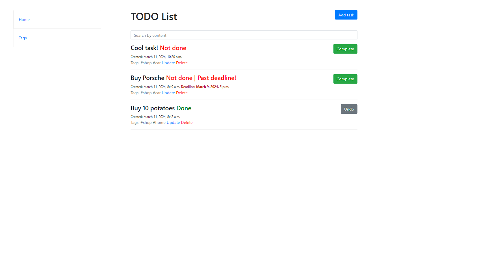

# TODO App
With this app you'll be able to track your tasks, sign tags for them and manage your day-to-day activities.



---

## Key Features

* Creating, editing and deletion of tasks
* Following deadlines, automatic highlighting of passed due tasks
* Creating custom tags and assigning tasks to them
* Searching by task content

## How To Use

To clone and run this application, you'll need Git and Python 3 installed on your computer. From your command line:

```bash
# Clone this repository
$ git clone https://github.com/kabust/todo-list.git

# Go into the repository
$ cd todo-list

# Create virtual environment
$ python -m venv venv

# Install dependencies
$ pip install -r requirements.txt

# Run the app
$ python manage.py runserver
```
After this you can browse TODO app under localhost:8000

## License

MIT
